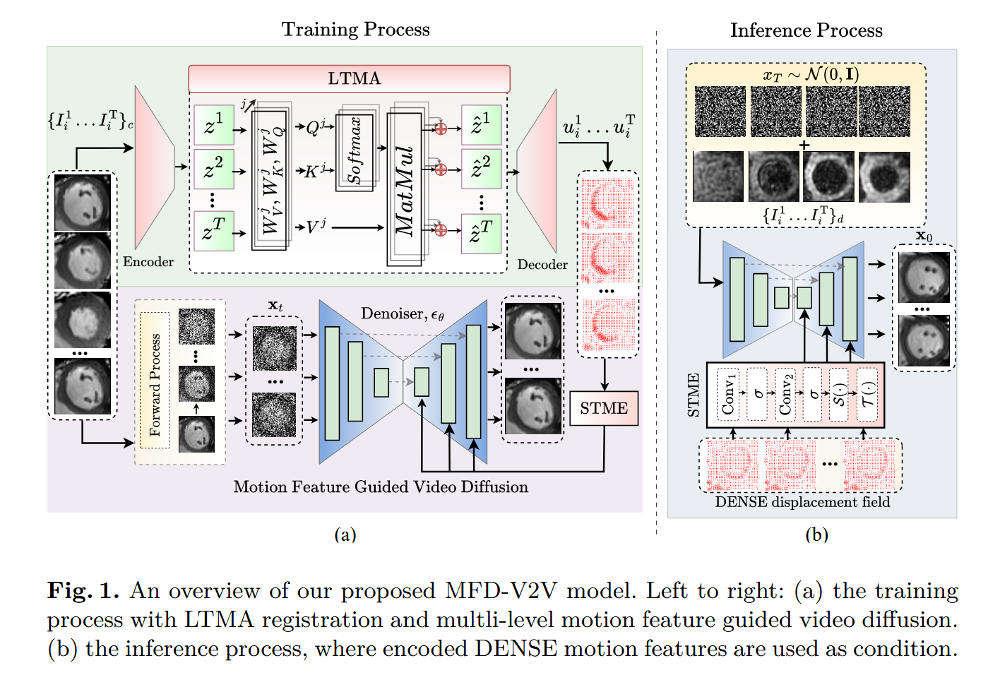
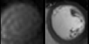
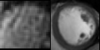

# MFD-V2D

Unsupervised Cardiac Video Translation Via Motion Feature Guided Diffusion Model

## Demonstration of MFD-V2V

## Train the Registration Network
If you want to train the registration network, then go to the "Train LTMA registration Network" and run the Main.py file. The code will automatically save the last checkpoint for you, so you don't need to do anything. After training the registration network put the checkpoint in the models folder. We already provide the pretrain weights of the registration network inside the models folder.

## Train the Diffusion Model
Run the train_video_flow_diffusion.py file. 

